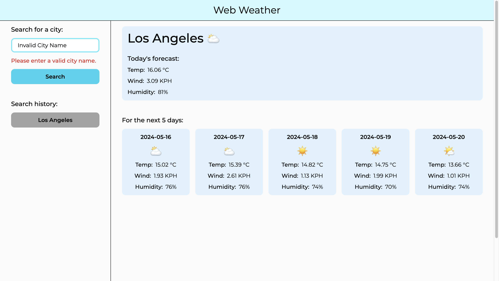

# Web Weather

## Description

I built this project to practice fetching information from an API and displaying it on a user interface. It is essential to practice this, since APIs are frequently used in websites, since they allow us to exchange information with different third party services. In this project I interacted with the OpenWeather API, which allowed me to built this project, since I don’t have access to real-time weather data, and this API allowed me to get it. During the development of this project, I learned how to interact with an API using async functions, and how to display the data that it gives me in a useful manner for the user to see.

## Installation

No installation is required, just visit the site by clicking the following link: https://eduardovela2022.github.io/Web-Weather/

## Usage

- To access the project click the following link: https://eduardovela2022.github.io/Web-Weather/
  After clicking the link you should she the homepage of the project.
  

- To check the weather forecast of a city, enter the name of a city in the search form of the sidebar. After entering the name of a city, you should see the weather forecast of said city. Also that city will be saved in your search history.
  
  

- If the city name is misspelled or it doesn’t exist, an error message will appear to notify you.
  

- To access your search history, just click on one of its items and the weather forecast of that item will be displayed. For example, we are seeing the weather forecast of Dallas, Texas, United States of America, but if I want to view again the weather forecast of Los Angeles, California, United States of America, I just need to click the item in the search history with its name.
  
  

## Credits

- To make the mobile search history scrollable:

  - Juviler, J. (2024, April 3). How to hide the Scrollbar in CSS. HubSpot Blog. https://blog.hubspot.com/website/hide-scrollbar-css
  - W3Schools. (n.d.). CSS layout - overflow. CSS Overflow. https://www.w3schools.com/css/css_overflow.asp

- To use async functions and the fetch API:

  - Mozilla. (n.d.-b). Using the fetch API - web apis: MDN. MDN Web Docs. https://developer.mozilla.org/en-US/docs/Web/API/Fetch_API/Using_Fetch

- To remove elements:

  - Mozilla. (n.d.-a). Node: Removechild() method - web apis: MDN. MDN Web Docs. https://developer.mozilla.org/en-US/docs/Web/API/Node/removeChild#

- To get the latitude and longitude of a city:

  - OpenWeather. (n.d.). Geocoding API. Geocoding API - OpenWeatherMap. https://openweathermap.org/api/geocoding-api

- To get the current day forecast:

  - OpenWeather. (n.d.). Current weather data. Current weather data - OpenWeatherMap. https://openweathermap.org/current

- To get a forecast of the next five days:
  - OpenWeather. (n.d.). 5 Day Weather Forecast. 5 Day Weather Forecast - OpenWeatherMap. https://openweathermap.org/forecast5

## License

Web Weather is under the MIT license.
